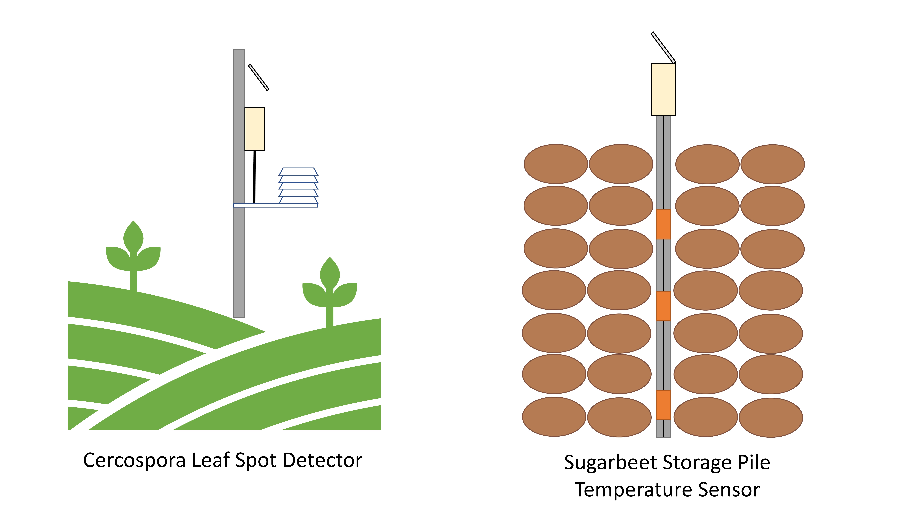

# Scalable Monitoring of Cercospora Leaf Spot and Temperature in Beet Storage Piles using Low-Cost, Internet of Things (IoT) Systems 

A multi-functional, low-cost, IoT data logger created for monitoring sugarbeet crop health and storage by the [Colorado State University (CSU) Agricultural Water Quality Program (AWQP)](https://waterquality.colostate.edu).

## Project Members

* A.J. Browna, Agricultural Data Scientist, Ansley.Brown@colostate.edu
* Emmanuel Deleona, Technical Research Lead, e.deleon@colostate.edu
* Erik Wardlea, Program Director, Erik.Wardle@colostate.edu

aColorado State University Agricultural Water Quality program

## Project Summary
As technology improves and scale, low-cost alternatives to traditional environmental sensors continue to emerge in the agricultural sector. In sugar beet production, two main operations have been identified by the CSU AWQP, in collaboration with Western Sugar (WS) as an opportunity to capitalize on integrating low-cost, Internet of Things (IoT) sensing into the sugar production process: 1) detecting sugar beet susceptibility to cercospora leaf spot (CLS), a common and detrimental leaf pest, and 2) detecting sugar loss in post-harvest sugar beet piles with temperature sensors. In 2022, the CSU AWQP prototyped and deployed four temperature (T) and relative humidity (RH) sensors to determine daily infection values (DIVs) for CLS with the help of the University of Nebraska-Lincoln collaborators. Results from previous years indicated that the sensors were performing adequately such that they could be a reasonable substitute for current methods of monitoring CLS and storage pile temperature (PT). As such, WS has expressed interest in finding scalable ways to increase the number of sensors in use, as well as determine long-term solutions for data storage. This proposal details how CSU AWQP intends to increase functionality of existing IoT sensors used by WS and create educational workshops to train WS in the production of said sensors for future use.

## Table of Contents
- [Repo Contents](folder-contents)
- [3d prints](#3d-prints)
- [Parts List](#parts-list)
- [How-to guide](#how-to-guide)
- [Known Bugs](#known-bugs)
- [Future Developments](#future-developments)

---

## Repo Contents
* cercospora-sensor
    * file containing necessary firmware and associated files for flashing a particle boron device to become a cercospora leaf spot detector
* pileTemp-sensor
    * file containing necessary firmware and associated files for flashing a particle boron device to become a sugarbeet pile temperature monitor
* figures
    * figures embedded into README.md

## 3D Prints
Coming Soon!

As found on our [AWQP Printables page](https://www.printables.com/@AgWaterQuality_66019):
* Solar panel mount
* Battery and PCB mount

## Parts List
| Item                                   | Unit    | # of Units  | $/Unit    | Total Cost  | Link                                                                                                                                                                                                                   |  |  |  |  |  |  |  |  |  |  |  |  |
|----------------------------------------|---------|-------------|-----------|-------------|------------------------------------------------------------------------------------------------------------------------------------------------------------------------------------------------------------------------|--|--|--|--|--|--|--|--|--|--|--|--|
| SHT31 Sensor                           | each    | 1           |  $13.95   |  $13.95     | https://www.adafruit.com/product/2857                                                                                                                                                                                  |  |  |  |  |  |  |  |  |  |  |  |  |
| Grove Shield                           | each    | 1           |  $5.95    |  $5.95      | https://www.adafruit.com/product/4309                                                                                                                                                                                  |  |  |  |  |  |  |  |  |  |  |  |  |
| Boron                                  | 50pk    | 50          |  $47.50   |  $2,375.00  |                                                                                                                                                                                                                        |  |  |  |  |  |  |  |  |  |  |  |  |
| Grove Connector Lead                   | 5pk     | 1           |  $8.59    |  $8.59      | https://www.amazon.com/Seeedstudio-Grove-Universal-Buckled-Cable/dp/B01CNZ9RJO?th=1                                                                                                                                    |  |  |  |  |  |  |  |  |  |  |  |  |
| PG7 Plastic Gromet                     | 20 pk   | 1           |  $7.99    |  $7.99      | https://www.amazon.com/Lokman-Plastic-Waterproof-Adjustable-Connectors/dp/B06Y5HGYK2?th=1                                                                                                                              |  |  |  |  |  |  |  |  |  |  |  |  |
| ¾" EMT Raintight Compression Connector | 20 qty  | 1           |  $25.27   |  $25.27     | https://www.homedepot.com/p/Halex-3-4-in-Electrical-Metallic-Tube-Raintight-Compression-Connectors-20-Pack-62502B/300183944                                                                                            |  |  |  |  |  |  |  |  |  |  |  |  |
| Solar Panel With Weatherproof Wiring   | each    | 1           |  $19.95   |  $19.95     | https://www.adafruit.com/product/5366                                                                                                                                                                                  |  |  |  |  |  |  |  |  |  |  |  |  |
| Lithium-Ion Battery                    | each    | 1           |  $19.95   |  $19.95     | https://www.adafruit.com/product/354                                                                                                                                                                                   |  |  |  |  |  |  |  |  |  |  |  |  |
| Charger                                | 5pk     | 1           |  $9.99    |  $9.99      | https://www.amazon.com/Micro-Cable-12inch-22AWG-Pigtail/dp/B09DKYPCXK                                                                                                                                                  |  |  |  |  |  |  |  |  |  |  |  |  |
| GPS                                    | each    | 1           |  $29.95   |  $29.95     | https://www.amazon.com/Lokman-Plastic-Waterproof-Adjustable-Connectors/dp/B06Y5HGYK2?th=1                                                                                                                              |  |  |  |  |  |  |  |  |  |  |  |  |
| Case Enclosure                         | each    | 1           |  $9.99    |  $9.99      | https://www.amazon.com/dp/B0787B1GT3/ref=redir_mobile_desktop?_encoding=UTF8&ref_=yo_ii_img&th=1                                                                                                                       |  |  |  |  |  |  |  |  |  |  |  |  |
| Silica Pack                            | 30pk    | 1           |  $9.99    |  $9.99      | https://www.amazon.com/Dry-Premium-Packets-Desiccants-Dehumidifier/dp/B00VJ02VMK/ref=sr_1_3?crid=27DLR5YA4ZQID&keywords=10g%2Bsilica%2Bgel%2Bpackets&qid=1675185727&sprefix=10%2Bg%2Bsilica%2B%2Caps%2C139&sr=8-3&th=1 |  |  |  |  |  |  |  |  |  |  |  |  |
| Four Core Wire 22g                     | 100ft   | 1           |  $46.75   |  $46.75     | https://www.amazon.com/dp/B07TK8ZHY6/ref=redir_mobile_desktop?_encoding=UTF8&ref_=ya_aw_od_pi&th=1                                                                                                                     |  |  |  |  |  |  |  |  |  |  |  |  |
| Heat Shrink                            | 50ft    | 1           |  $23.99   |  $23.99     | https://www.amazon.com/dp/B08W7RB32Z/ref=redir_mobile_desktop?_encoding=UTF8&ref_=yo_ii_img&th=1                                                                                                                       |  |  |  |  |  |  |  |  |  |  |  |  |
| 3D Printed PETG Filament               | each    | 1           |  $24.99   |  $24.99     | https://www.amazon.com/dp/B08ZB6X2M6/ref=twister_B08D2FTPS7?_encoding=UTF8&th=1                                                                                                                                        |  |  |  |  |  |  |  |  |  |  |  |  |
| Solder Seal Wire Connectors            | 500pcs  | 1           |  $34.99   |  $34.99     | https://www.amazon.com/dp/B07TK8ZHY6/ref=redir_mobile_desktop?_encoding=UTF8&ref_=ya_aw_od_pi&th=1                                                                                                                     |  |  |  |  |  |  |  |  |  |  |  |  |
| EMT Steel Conduit                      | each    | 1           |  $6.98    |  $6.98      | https://www.homedepot.com/p/3-4-in-x-5-ft-Electrical-Metallic-Tubing-EMT-Steel-Conduit-0550105000/202068070                                                                                                            |  |  |  |  |  |  |  |  |  |  |  |  |
| EMT T Conduit Body                     | each    | 1           |  $15.41   |  $15.41     | https://www.amazon.com/dp/B07RRZ5S1P?psc=1&smid=A2ENTBEZKGXKVW&ref_=chk_typ_quicklook_titleToDp                                                                                                                        |  |  |  |  |  |  |  |  |  |  |  |  |
|                                        |         | Total Cost: |  $362.18  |  $2,689.68  |                                                                                                                                                                                                                        |  |  |  |  |  |  |  |  |  |  |  |  |

## How-To Guide

1. Purchase all necessary hardware components 
2. 3D-print necessary mounting parts
3. Assemble hardware
4. Flash code
5. Using [particle console](https://console.particle.io/devices), create a webhook to your desired data collection platform (e.g., Ubidots, Azure, etc.) 
    * The CSU AWQP uses [Ubidots](https://industrial.ubidots.com/)
6. Check to ensure data is being transmitted correctly on data collection platform
7. Calculate DIVs using cloud-processing and deliver to stakeholders as needed.

## Known Bugs
* Cercospora Sensor
    * GPS code is not working correctly, and has been commented out for now
* Pile Temp. Sensor
    * Hourly readings are too power-consumptive, so we have switched to 2-hr. readings for now
* Both
    * The solar panels only charge ~50% of the time.  We suspect the battery is too large, but this will require further testing

## Future Developments
* Cercospora Sensor
    * Use ubidots to calculate DIVs instead of relying totally on UNL dashboard
* Pile Temp. Sensor
    
* Both
    * Integrate GPS if it's not too power consumptive