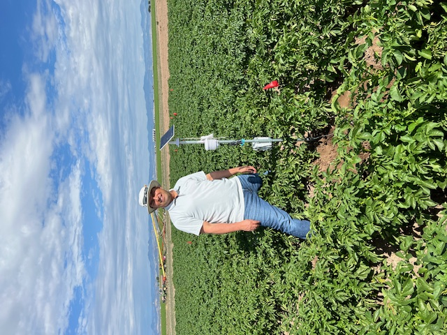
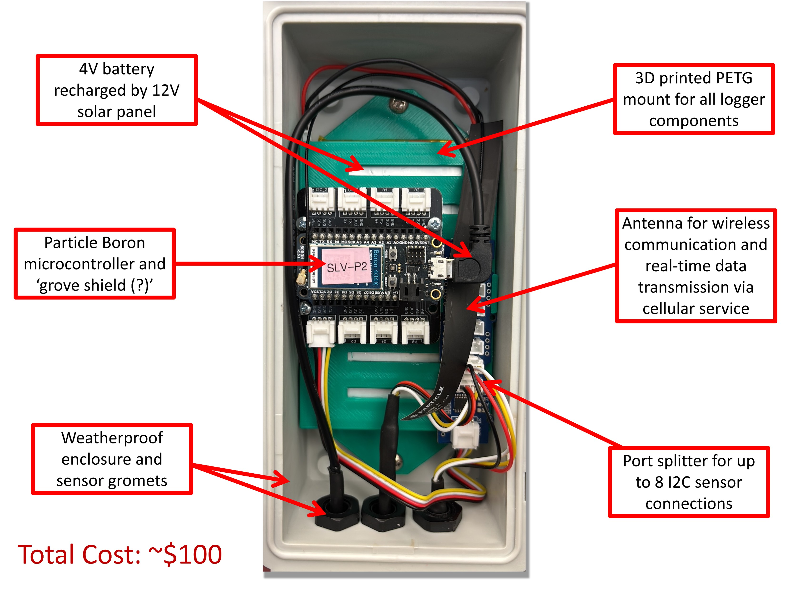
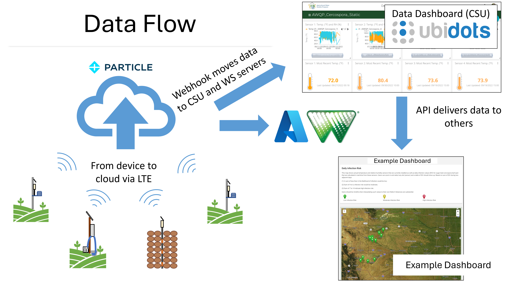

  

# AWQP IoT Data Loggers

A multi-functional, low-cost, IoT data logger platform created for scalable environmental and agricultural monitoring by the [Colorado State University (CSU) Agricultural Water Quality Program (AWQP)](https://agsci.colostate.edu/waterquality/).

> [!NOTE]
> **Project Status: Research & Development**
>
> This project is actively under development by our research team. It is currently intended to showcase our research applications and the logger's versatility. The code, parts, and instructions are subject to change as we enhance the platform. The `main` branch does not contain firmware code; please see the branches for each logger type.

---

## Table of Contents

- [Project Summary](#project-summary)
- [Repository Structure](#repository-structure-core--branch-model)
- [Repo Contents](#repo-contents)
- [Available Implementations (Branches)](#available-implementations-branches)
- [Core Logger Platform](#core-logger-platform-description)
- [Software & Data ](#software--data-pipeline)
- [Project Status](#project-status)
- [Recommended Tools](#recommended-tools)
- [Contact & Collaboration](#contact--collaboration-🤝)
- [Acknowledgements & Collaborators](#acknowledgements--collaborators-💰)
- [License](#license)
- [About Us](#about-us)

---

## Project Summary

Environmental monitoring is critical for proper system characterization and management, but it is often costly and time-consuming.
* **Data Lag:** Traditional sensors require manual, in-field data collection, which delays important management decisions.
* **High Cost:** Existing commercial sensors that offer cloud-based (IoT) services are often too costly to scale for larger research questions or high-density field monitoring.

To address this, the CSU AWQP developed this modular, low-cost data logger. The goal is to provide a single, reliable, and affordable IoT platform (the "core") that can be easily adapted for numerous applications. This allows researchers to build and deploy sensor networks tailored to specific needs, enabling data-driven decisions that can improve efficiency and protect water quality. The open-source nature of the device allows any user to add additional sensor types and functionality.

---

## Repository Structure: Core & Branch Model

This repository is organized using a **Core & Branch** model.

* **`main` Core (You are here):**
    This branch is the central hub for the entire project. It contains the "core" information for the logger platform, including this general README and the primary **Bill of Materials (`AWQP_Logger_BOM.xlsx`)**.

* **Application Branches:**
    Each separate branch in this repository represents a unique, ready-to-deploy sensor application. These branches contain all the specific files for that build (firmware, specific build guides, and 3D-print files).

"Swapping sensors" is as simple as choosing the correct branch for your application and using its dedicated firmware and build guide.

  

---

## Repo Contents

The `main` branch contains the core files for the project:

* **`README.md`**: This file, providing a general overview of the platform.
* **`AWQP_Logger_BOM.xlsx`**: The master Bill of Materials for the *core* logger components (microcontroller, enclosure, power, etc.).
* **`LICENSE.md`**: The official GNU GPL V2.0 License for the project.
* **`.gitignore`**: A file that tells Git which files to ignore (e.g., local configuration files).

All application-specific files (firmware `*.ino`, 3D-print `*.stl` files, and specific guides) are located within their respective branches.

---

## Available Implementations (Branches)

Click on any branch to find its specific firmware and build guide.

* **[AWQP-Cercospora-Leaf-Spot-Sensor/Storage Monitoring](https://github.com/CSU-Agricultural-Water-Quality-Program/awqp-loggers/tree/AWQP-Cercospora-Leaf-Spot-Sensor)**
    * **Use Case:** Monitors in-canopy air temperature and humidity for predicting Cercospora leaf spot risk in sugar beets.
    * **Sensors:** SHT31 (Air Temp/Humidity)

  

* **[AWQP-Potato-Early-Blight-Sensor] This branch is under construction!**
    * **Use Case:** Monitors canopy conditions and soil temperature to anticipate disease pressure in potatoes.
    * **Sensors:** SHT31 (Air Temp/Humidity), SHT31 (Soil Temp)

  

* **[AWQP-eTape-Water-Level-Sensor] This branch is under construction!**
    * **Use Case:** Measures water level in flumes, ditches, or shallow wells to monitor agricultural runoff.
    * **Sensors:** eTape Water Level Sensor

  

---

## Core Logger Platform Description

The AWQP Logger is built from a core set of components that handle power, data processing, and cellular communication. The design allows it to be connected to sensors utilizing **$I^2C$** (via the Grove connector) or **analog** connections.

  

### Core Hardware Components

* **Microcontroller:** Particle Boron (LTE M1 Cellular)
* **Sensor Interface:** Adafruit Grove Shield FeatherWing
* **Power:** 3.7V LiPo Battery & 6V Solar Panel
* **Enclosure:** Waterproof TICONN (or similar) enclosure
* **3D-Printable Components:** To ensure accurate air temperature and humidity readings, we use our in-house, hardware-free **[Solar Radiation Shield](https://www.printables.com/model/1124805-hardware-free-radiation-shield-for-environmental-m)**.

A complete parts list is available in the `AWQP_Logger_BOM.xlsx` file.

---

## Software & Data 

1.  **Device:** The Particle Boron collects data from the attached sensor(s).
2.  **Particle Cloud:** The Boron uses its cellular connection to publish data to the Particle.io Device Cloud.
3.  **Webhook:** A Particle Cloud "Webhook" integration forwards this data to an external server.
4.  **Data Dashboard:** We use [Ubidots](https://ubidots.com/) as our primary data storage and visualization platform, allowing for real-time dashboards and alerts.

  

---

## Project Status

This logger is actively deployed and field-tested. Results indicate that this open-source alternative is accurate and provides a reasonable substitute for commercial methods in tested applications.

To date, **~40 loggers** have been built by researchers and agronomists and deployed in **4 states** (CO, WY, NE, MT).

---

## Recommended Tools

These tools are helpful for assembling the loggers.

| Item Name | Price | Unit | $/Unit | Qty | Total/Sensor | Link |
| :--- | :--- | :--- | :--- | :--- | :--- | :--- |
| Cone Drill Bit | $10.99 | each | $10.99 | 1 | $10.99 | [Amazon](https://a.co/d/d9EyOLx) |
| Magnetic Soldering Alligator Clips | $21.99 | each | $21.99 | 1 | $21.99 | [Amazon](https://www.amazon.com/KOTTO-Soldering-Magnetic-Flexible-Workshop/dp/B083SFWLW7/ref=sr_1_97?crid=1W1WI7KFN5MOK&keywords=magnetic%2Balligator%2Bclips&qid=1707339995&sprefix=magnetic%2Balli%2Caps%2C106&sr=8-97&th=1) |
| Wire Stripper | $25.99 | each | $25.99 | 1 | $25.99 | [Amazon](https://www.amazon.com/IRWIN-VISE-GRIP-2078300-Self-Adjusting-Stripper/dp/B000OQ21CA/ref=sr_1_15?crid=379UHPQLB7G9D&keywords=wire%2Bstripper&qid=1707340653&sprefix=wire%2Bs%2Caps%2C123&sr=8-15&th=1) |
| Mini Heat Gun with Heat Shield | $24.99 | each | $24.99 | 1 | $24.99 | [Amazon](https://www.amazon.com/SEEKONE-Handheld-Reflector-Embossing-Stripping/dp/B08VFY8THD/ref=sr_1_5?crid=3R62NG61UYLY0&keywords=mini+heat+gun&qid=1707340837&sprefix=mini+heat+gun%2Caps%2C94&sr=8-5) |
| Magnifying Glass w/ Light | $19.99 | each | $19.99 | 1 | $19.99 | [Amazon](https://www.amazon.com/Magnifying-Reading-Dimmable-Eye-Caring-Headboard/dp/B09M9YYSGB/ref=sr_1_42?crid=39IAFATUH0IKY&keywords=magnifying%2Bglass%2Bwith%2Blight&qid=1707342855&sprefix=magni%2Caps%112&sr=8-42&th=1) |

**Total Tools Cost:** $103.95

## Contact & Collaboration 

We welcome collaboration from other researchers, Extension agents, and agricultural professionals. For questions about the hardware, to discuss potential applications, or to propose a collaboration, please contact **Jake Ladow** at **Jake.Ladow@colostate.edu**, or our Program Director, **Erik Wardle** at **Erik.Wardle@colostate.edu**.

---

## Acknowledgements & Collaborators 

This project is a collaborative effort and is made possible through the support and partnership of several key organizations. We extend our sincere thanks to:

* **The Western Sugar Cooperative (Grower Owned)**
* **CSU San Luis Valley Extension**
* **CSU Western Colorado Research Center (WCRC) at Orchard Mesa**

---

## License

This project is licensed under the GNU GENERAL PUBLIC LICENSE Version 2 (GNU GPL V2.0) - see the [LICENSE.md](LICENSE.md) file for details.

Copyright © 2025 Colorado State University Agricultural Water Quality Program. All rights reserved.

---

## About Us

This project is developed and maintained by the **[CSU Agricultural Water Quality Program (AWQP)](https://agsci.colostate.edu/waterquality/)**. Our program is a collaborative effort between CSU Extension and the Agricultural Experiment Station. We conduct research and provide outreach on Best Management Practices (BMPs) to help Colorado's agricultural producers protect the state's water resources.

### Project Members

* **Jake Ladow**a,  Field Operations Lead, Jake.Ladow@colostate.edu
* **A.J. Brown**a, Agricultural Data Scientist, Ansley.Brown@colostate.edu
* **Emmanuel Deleon**a, Technical Research Lead, e.deleon@colostate.edu
* **Erik Wardle**a, Program Director, Erik.Wardle@colostate.edu

aColorado State University Agricultural Water Quality Program

---

